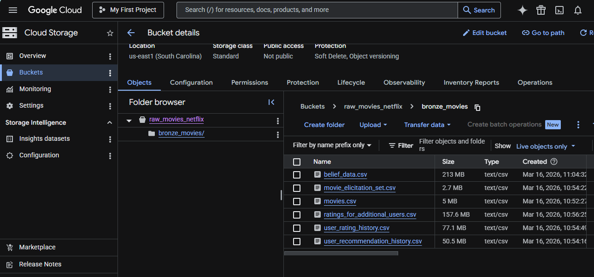
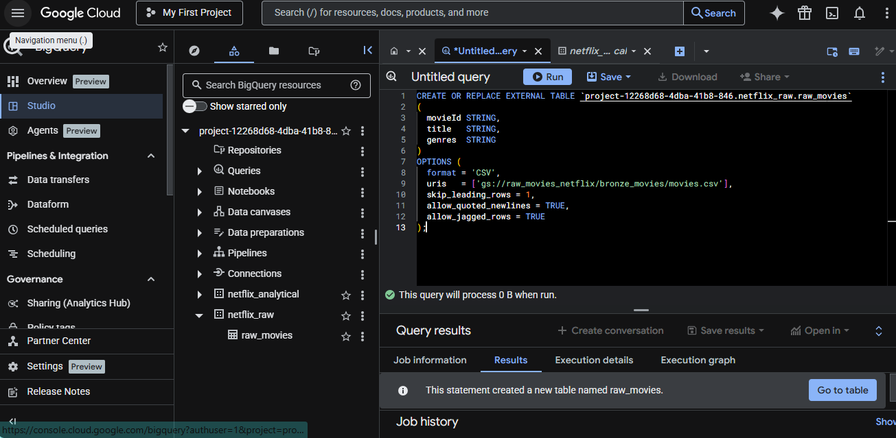
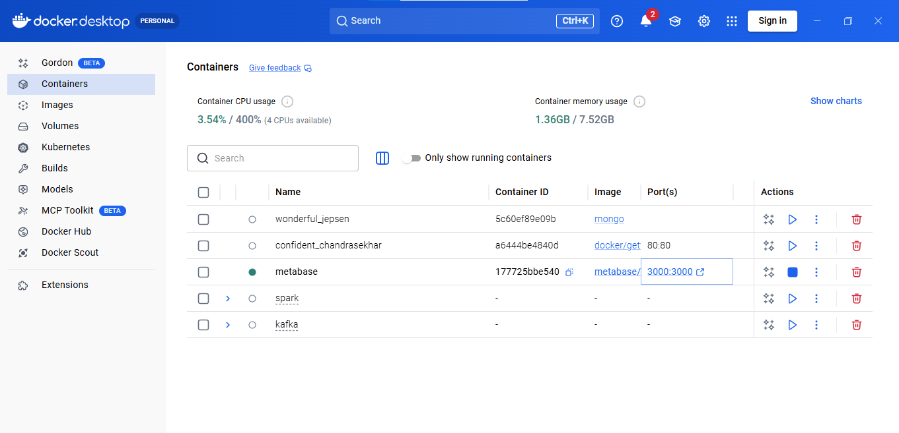
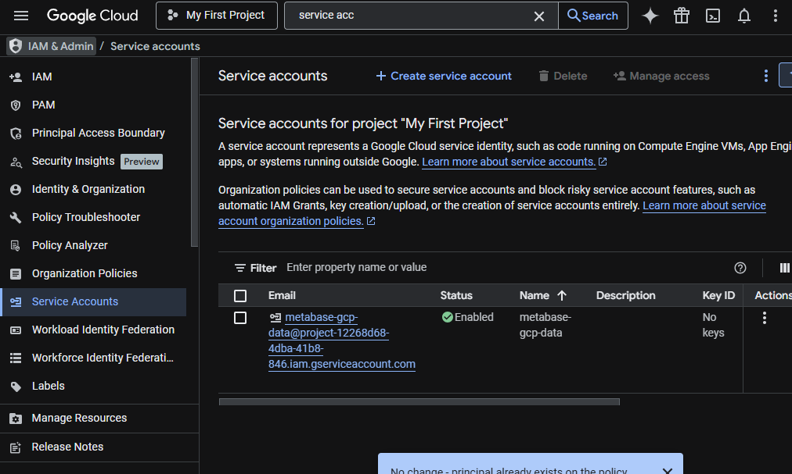
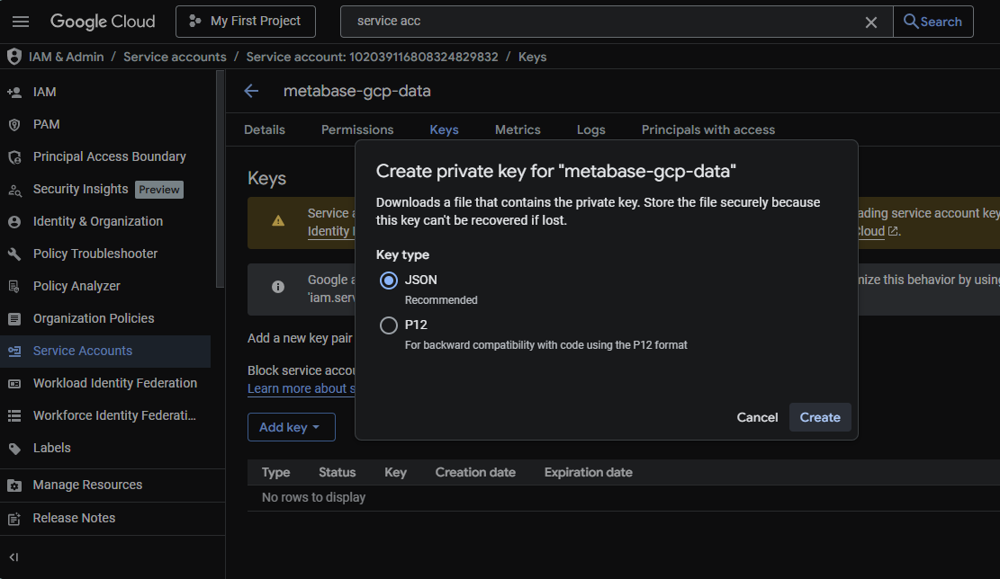
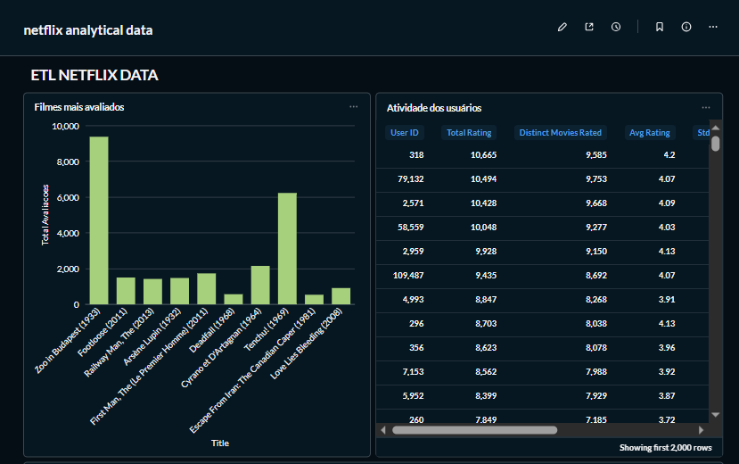
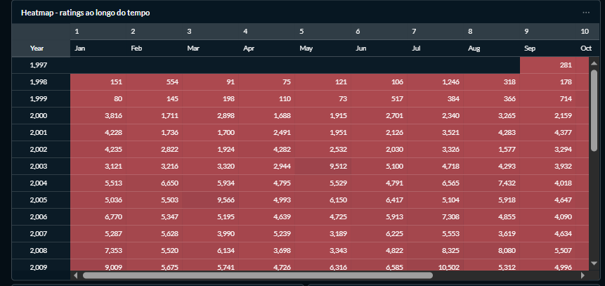
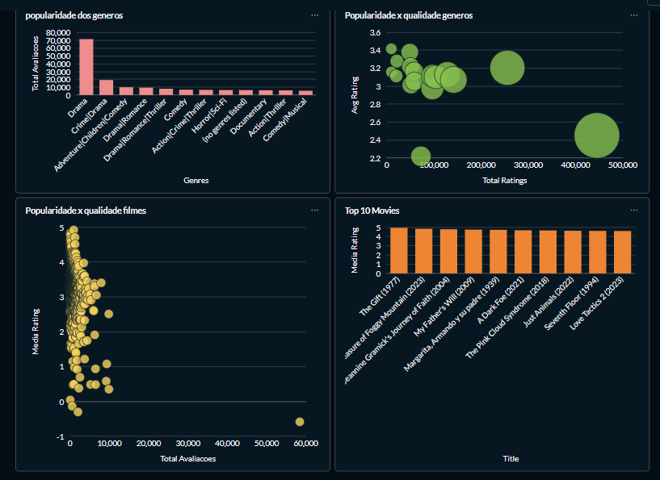

# Ingestão de Dados com BigQuery e Metabase: Arquitetura Bronze, Silver e Gold

Este projeto demonstra a construção de um pipeline de dados ponta a ponta, utilizando o dataset do MovieLens para criar uma plataforma de analytics de filmes.

## 🛠️ Tecnologias Utilizadas

- Google Cloud Storage (GCS): Armazenamento dos arquivos raw.

- BigQuery: Data Warehouse para processamento e modelagem SQL.

- Docker: Containerização do ambiente de visualização.

- Metabase: Ferramenta de BI para criação de dashboards.

- SQL: Transformação e modelagem dimensional.

## 🏗️ Arquitetura do Projeto

O projeto foi dividido em camadas para garantir a integridade dos dados:

### 🥉 Camada Bronze (Raw)
Os dados originais (CSV) são ingeridos no Google Cloud Storage (GSC) e disponibilizados no BigQuery via External Tables.

Fonte: [MovieLens Dataset](https://grouplens.org/datasets/movielens/ml_belief_2024/).

Processo: Criação de tabelas externas que apontam para os buckets no GCS.


### 🥈 Camada Silver (Limpeza / Processamento)

Na camada Silver, os dados brutos da Bronze são transformados em tabelas nativas do BigQuery. Algumas transformações realizadas:

- Limpeza: Remoção de duplicatas e tratamento de caracteres especiais.

- Tipagem (Casting): Conversão de **STRING** para **INT64** ou **FLOAT64**.

### 🥇 Camada Gold 
Aqui, os dados são limpos também, transformados e modelados seguindo as regras de negócio para facilitar o consumo pelo Metabase.

Transformações:

- Casting de tipos de dados (String para Int/Float).

- Extração do ano de lançamento do título usando REGEXP_EXTRACT.

- Cálculo de métricas agregadas (Média de avaliação, Desvio Padrão).

## 🚀 Como Executar o Projeto

1. Configuração do GCP

- Crie um projeto no Google Cloud Console. **O Google Cloud oferece um crédito inicial de $300 para novos usuários (primeiro acesso), o que permite executar todo este projeto sem custos**

- Crie um Bucket no Cloud Storage e faça o upload dos arquivos.csv



- Configure uma Service Account com as permissões (BigQuery Data Viewer, BigQuery Job User, Storage Insights Viewer)

2. Crie a camada Bronze pelo Bigquery. Nesta etapa, os dados são ingeridos diretamente do Google Cloud Storage como tabelas externas, mantendo o formato original (todos como STRING).Exemplo: tabela de filmes

```
CREATE OR REPLACE EXTERNAL TABLE `project-12268d68-4dba-41b8-846.netflix_raw.raw_movies`
(
  movieId STRING,
  title   STRING,
  genres  STRING
)
OPTIONS (
  format = 'CSV',
  uris   = ['gs://raw_movies_netflix/bronze_movies/movies.csv'],
  skip_leading_rows = 1,
  allow_quoted_newlines = TRUE,
  allow_jagged_rows = TRUE
);

```


3. Crie a camada Silver (Dimensões e Fatos) - Dimensão Filmes (dim_movies): Extrai o ano de lançamento do título usando Regex e converte os tipos de dados.

### dim_movies:

```
CREATE OR REPLACE TABLE `project-12268d68-4dba-41b8-846.netflix_analytical.dim_movies` AS
SELECT
  SAFE_CAST(movieId AS INT64) as movie_id,
  CAST(title AS STRING) as title,
  CAST(genres AS STRING) as genres,
  SAFE_CAST(REGEXP_EXTRACT(CAST (title as STRING), r'\((\d{4})\)\s*$') as INT64) as release_year
  from `project-12268d68-4dba-41b8-846.netflix_raw.raw_movies`;
  
  ```

### fact_ratings:

  ```
  CREATE OR REPLACE TABLE `project-12268d68-4dba-41b8-846.netflix_analytical.fact_ratings` AS
WITH all_ratings AS (
  SELECT 
    SAFE_CAST(NULLIF(userId, '') AS INT64) AS user_id,
    SAFE_CAST(NULLIF(movieId, '') AS INT64) AS movie_id,


    -- remove NA/ null
    SAFE_CAST(NULLIF(NULLIF(rating, 'NA'),'')AS FLOAT64) AS rating,

    --aceita timestamp com ou sem timezone
    COALESCE(
      SAFE.PARSE_TIMESTAMP('%Y-%m-%d %H:%M:%S%Ez', tstamp),
      SAFE.PARSE_TIMESTAMP('%Y-%m-%d %H:%M:%S', tstamp)

    ) AS rating_ts,

    'user_rating_history' AS src

  from  `project-12268d68-4dba-41b8-846.netflix_raw.raw_user_rating_history`

  UNION ALL

  select 
    SAFE_CAST(NULLIF(userId,'') AS INT64) AS user_id,
    SAFE_CAST(NULLIF(movieId,'') AS INT64) AS movie_id,

    SAFE_CAST(NULLIF(NULLIF(rating, 'NA'),'')AS FLOAT64) AS rating,

    COALESCE(
      SAFE.PARSE_TIMESTAMP('%Y-%m-%d %H:%M:%S%Ez', tstamp),
      SAFE.PARSE_TIMESTAMP('%Y-%m-%d %H:%M:%S', tstamp)

    ) AS rating_ts,

    'rating_for_additional_users' AS src

  FROM `project-12268d68-4dba-41b8-846.netflix_raw.raw_ratings_for_additional_users`

)

SELECT
  user_id,
  movie_id,
  rating,
  rating_ts,
  src 
FROM all_ratings
WHERE user_id IS NOT NULL
  AND movie_id IS NOT NULL
  AND rating IS NOT NULL
  AND rating_ts IS NOT NULL;
  
  ```

4. Crie a camada Gold (Views para Visualização)
Views criadas para alimentar diretamente os dashboards no Metabase com KPIs calculados.

```
CREATE OR REPLACE VIEW `project-12268d68-4dba-41b8-846.netflix_analytical.vw_movies_kpis` AS
( -- query -- )

```

5. Baixe o metabase com docker

```docker run -d -p 3000:3000 --name metabase metabase/metabase```



6. Conecte o Metabase ao BigQuery

Criei um service account no GCP

### Permissões:

- BigQuery Data Viewer
- BigQuery Job User
- BigQuery Metadata Viewer
- Storage Insights Viewer

Estas permissões permitem:

- consultar tabelas
- executar queries
- acessar metadados
- ler arquivos do GCS





- No Metabase, acesse o Admin → Banco de dados → Adicionar banco de dados
- Selecione BigQuery
- Informe o Project ID e faça upload do Service Account JSON
- Sincronize: Admin → Banco de dados → Sync database schema

7. Crie as Questions no metabase (gráficos)

Exemplos de visualizações criadas:
- Evolução de ratings ao longo do tempo (Heatmap)
- Ranking de filmes - top 10 (Bar Chat)
- Filmes mais avaliados - (Bar Chat)
- Popularidade dos gêneros - (Bar Chat)





